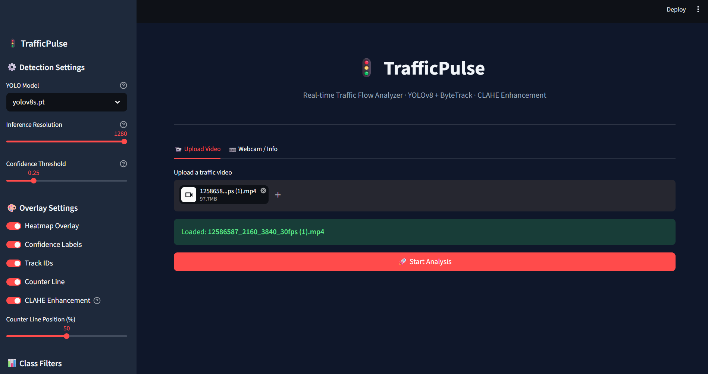
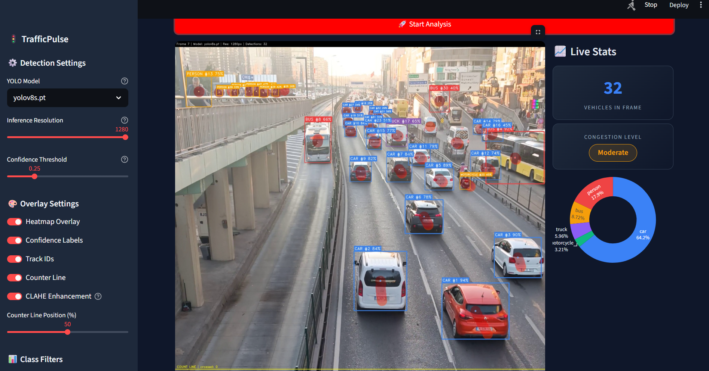
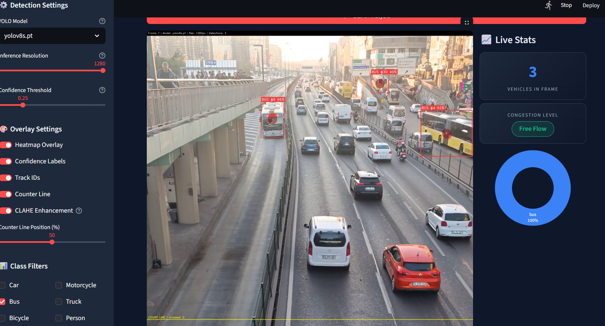

# 🚦 TrafficPulse — Intelligent Traffic Flow Analyzer

<p align="center">
  
  
  
  
  
</p>

<p align="center">
  <b>Real-time multi-class vehicle detection, tracking, and traffic analytics powered by YOLOv8 + ByteTrack with a sleek Streamlit dashboard.</b>
</p>

---

## 📸 Screenshots

### Upload & Start

> Clean upload interface — supports MP4, AVI, MOV, MKV up to any size. Full sidebar controls for model, resolution, and overlays.

### Live Detection — Heavy Traffic (32 Vehicles Detected)

> YOLOv8s running at 1280px resolution with ByteTrack IDs, heatmap overlay, confidence labels, and real-time congestion scoring. **32 vehicles detected** with class breakdown in the donut chart.

### Class Filter Mode — Bus Only

> Class filters let you isolate specific vehicle types. Here showing only buses with persistent track IDs across frames.

---

## ✨ Features

| Feature | Description |
|---|---|
| 🎯 **Multi-class Detection** | Cars, trucks, buses, motorcycles, bicycles, pedestrians |
| 🔁 **ByteTrack** | State-of-the-art multi-object tracker — persistent IDs, no ID swaps |
| 🌡️ **Heatmap Overlay** | Visualize spatial traffic density accumulating over time |
| 🔬 **CLAHE Enhancement** | Contrast boost before inference — catches objects in dark/flat areas |
| 📍 **Virtual Line Counter** | Count vehicles crossing a configurable line per class |
| 📊 **Congestion Scoring** | Free Flow → Light → Moderate → Heavy → Gridlock |
| 📈 **Live Charts** | Vehicle count timeline + class distribution donut chart |
| 🎛️ **Full Sidebar Control** | Model size, resolution, confidence, class filters, overlays |
| 📹 **Video & Webcam** | Upload MP4/AVI/MOV or stream from webcam live |

---

## 🚀 Quick Start

### 1. Clone the repository
```bash
git clone https://github.com/DamiaYuhanes/TrafficPulse.git
cd TrafficPulse
```

### 2. Create a virtual environment (recommended)
```bash
python -m venv venv
# Windows
venv\Scripts\activate
# macOS/Linux
source venv/bin/activate
```

### 3. Install dependencies
```bash
pip install -r requirements.txt
```
> YOLOv8 weights are downloaded automatically on first run.

### 4. Launch the dashboard
```bash
streamlit run app.py
```

Open **http://localhost:8501** in your browser 🎉

---

## 📁 Project Structure

```
TrafficPulse/
├── app.py            # Streamlit dashboard (main entry point)
├── detector.py       # YOLOv8 + ByteTrack engine, CLAHE preprocessing
├── tracker.py        # Virtual line crossing counter
├── analytics.py      # Heatmap accumulator, congestion scoring, timeline
├── requirements.txt  # Dependencies
├── assets/           # Screenshots & media
└── README.md
```

---

## 🧠 How It Works

```
Video Frame
    │
    ▼
┌──────────────┐
│ CLAHE Enhance│  ← Boost contrast for dark/low-quality footage
└──────┬───────┘
       │
       ▼
┌──────────────┐
│   YOLOv8s    │  ← Detect objects at 1280px resolution
│  @1280px     │     conf=0.25, agnostic NMS, iou=0.45
└──────┬───────┘
       │
       ▼
┌──────────────┐
│  ByteTrack   │  ← Assign persistent IDs across frames
└──────┬───────┘
       │
       ├──► Line Counter    (per-class vehicle counts)
       ├──► Heatmap         (spatial density over time)
       └──► Timeline        (count per second chart)
                │
                ▼
        ┌──────────────┐
        │  Streamlit   │  ← Annotated frames + live charts + stats
        └──────────────┘
```

---

## ⚙️ Configuration Options

| Option | Default | Description |
|---|---|---|
| Model | `yolov8s.pt` | n (fast) / s (balanced) / m / l (accurate) |
| Resolution | `1280px` | Higher = detects small/distant objects |
| Confidence | `0.25` | Lower = more detections |
| CLAHE | On | Contrast enhancement before inference |
| Heatmap | On | Spatial density overlay |
| Track IDs | On | Show ByteTrack persistent IDs on boxes |
| Counter Line | 50% | Vertical position of counting line |
| Class Filter | All | Toggle individual vehicle classes |

---

## 🧪 Tested With

- Python 3.10, 3.11, 3.12
- Windows 11
- CPU inference (real-time on YOLOv8n/s) and GPU (CUDA)
- 4K traffic footage (3840×2160 @ 30fps)

---

## 🛣️ Roadmap

- [ ] Speed estimation (pixels/frame → km/h calibration)
- [ ] Multi-lane tracking with lane assignment
- [ ] Export analytics report as PDF
- [ ] RTSP/IP camera stream support
- [ ] Vehicle re-identification across camera cuts

---

## 📄 License

MIT License — free to use, modify, and distribute.

---

<p align="center">Made with ❤️ by <a href="https://github.com/DamiaYuhanes">DamiaYuhanes</a> · Powered by <a href="https://ultralytics.com">Ultralytics YOLOv8</a></p>
